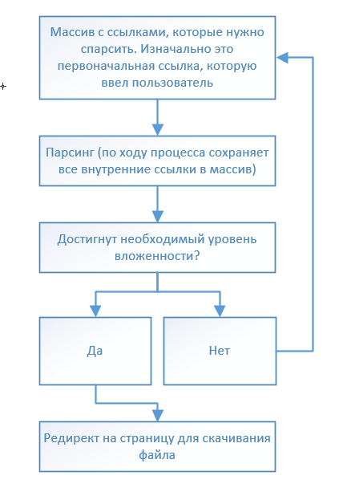

Парсер для тестового задания Timeweb

### Требования

Рекомендуемая версия Python=3.8. Перед запуском открыть терминал и установить необходимые зависимости с помощью `pip install -r requirements.txt`. Запуск `python app.py`

### Задание

Написать API на Flask для парсинга сайтов с двумя методами. POST запрос получает адрес сайта и в ответ возвращает ID задачи. GET запрос по ID задачи возвращает текущее состояние задачи. Когда задача выполнена, возвращает URL, по которому можно скачать архив.
В задание входит парсер, который пробегается по сайту с лимитированной вложенностью, например, до 3 уровней и сохраняет html/css/js и медиа файлы.

### Комментарий

Очистка storage по окончанию работы парсера здесь не предусмотрена, но может быть добавлена при необходимости в реальном использовании.

В задании не было указано требуемой архитектуры файлов, то в кратце принцип работы можно описать так: 
1. При начале работы парсера создается директория storage, в которой хранятся папки с id задачи
2. В папке с id задачи создаются папки для хранения всех HTML, css, js и media файлов (они все просто складываются в кучу). 
3. По окончанию работы парсера из папки с id задачи делается архив с названием id задачи и кладется в корневую директорию (рядом с app.py)

Также - поскольку часть ссылок на файлы в интернете имеют запрещенные для называния ими символы (к примеру сайт отссылается на `www.google.com/some_css_file?la:`, но сохранить файл с таким названием в windows нельзя)
то эти названия были заменены на названия следующего типа - `external_ТИП_НОМЕР`, где ТИП - это html/css/js/media, а номер - порядковый номер стороннего файла на сайте

### Принцип работы

В общем представлении процесс можно представить в виде небольшой схемы:

